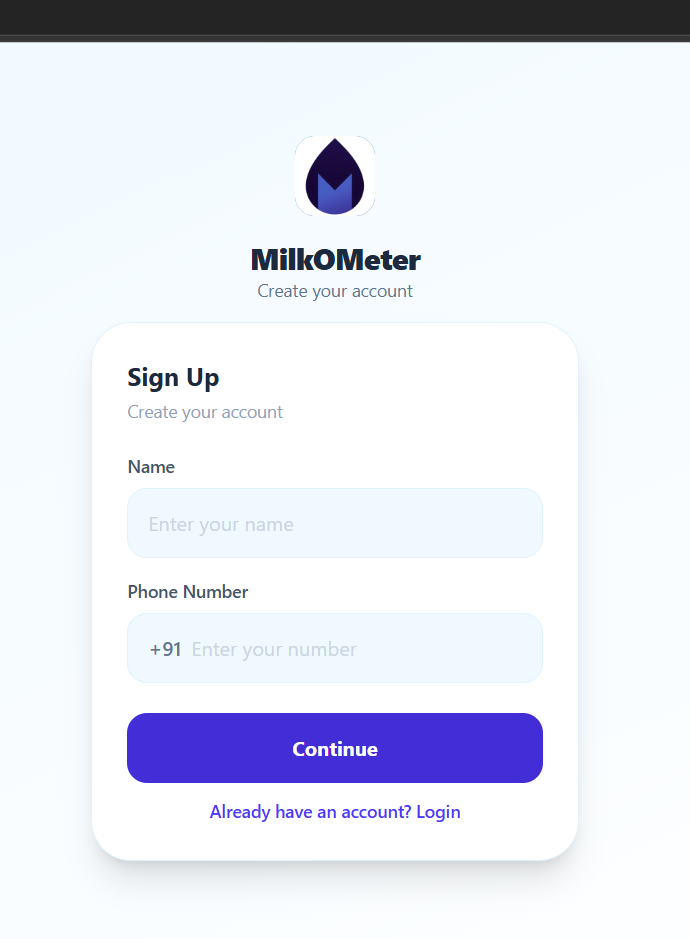
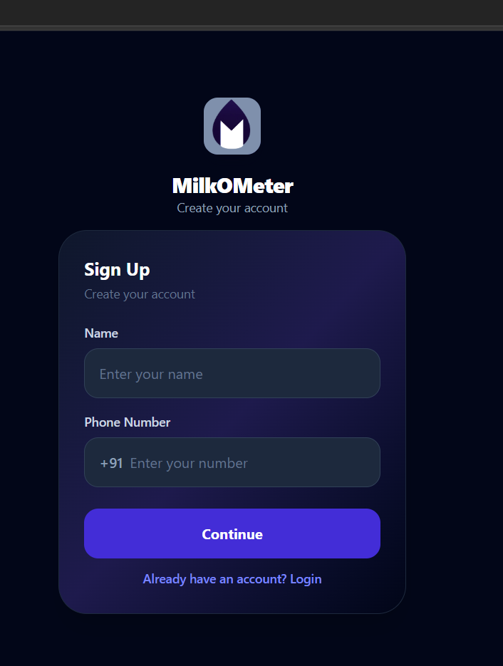
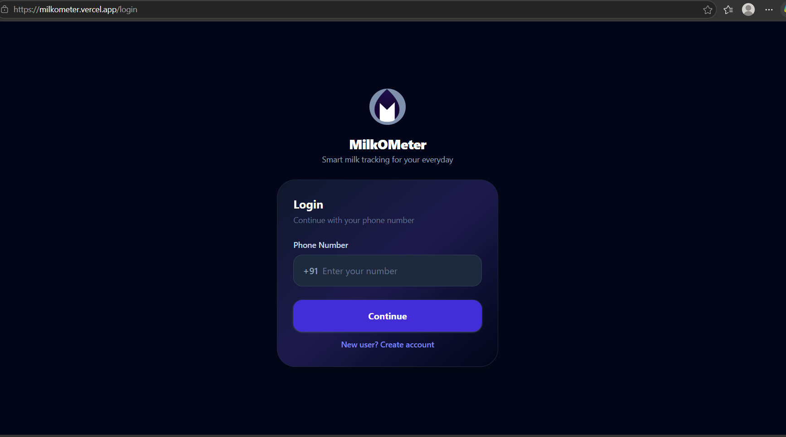
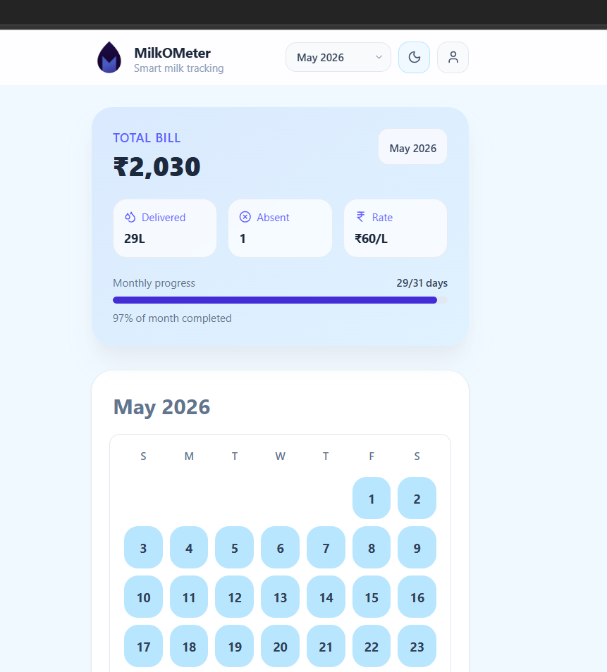
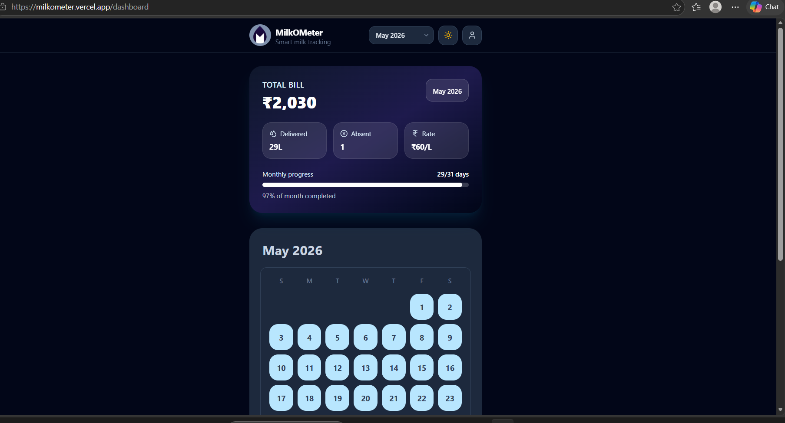
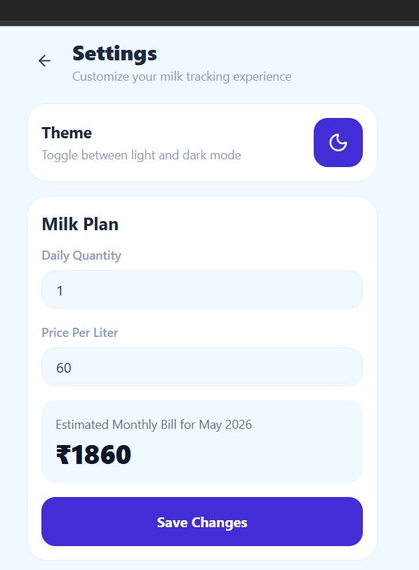
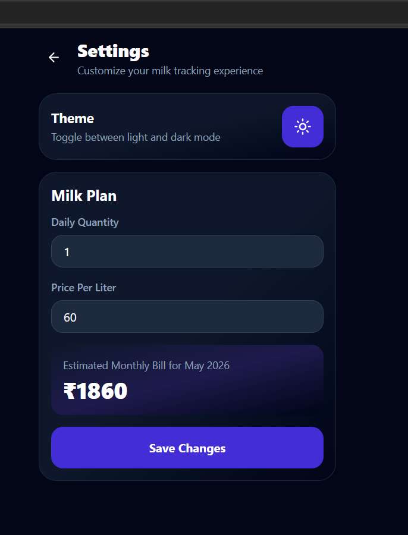
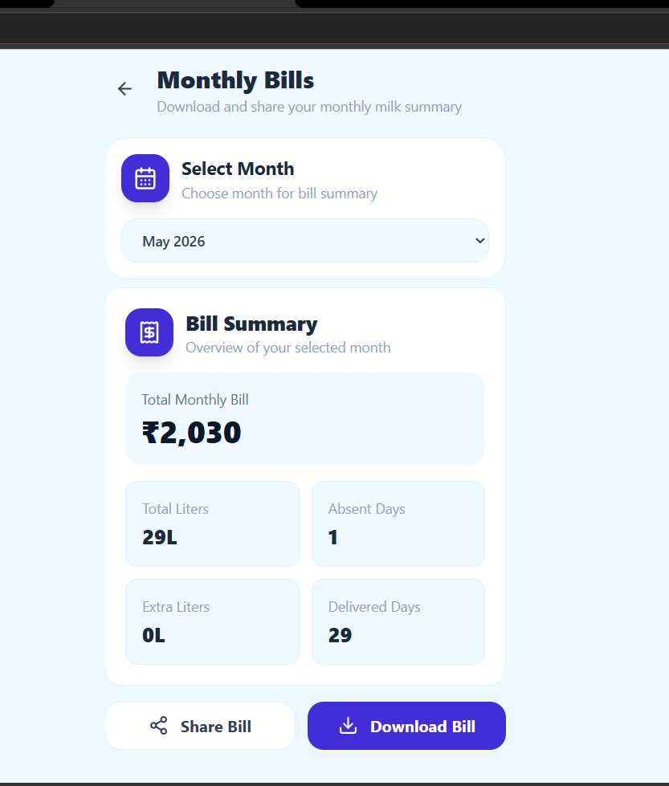
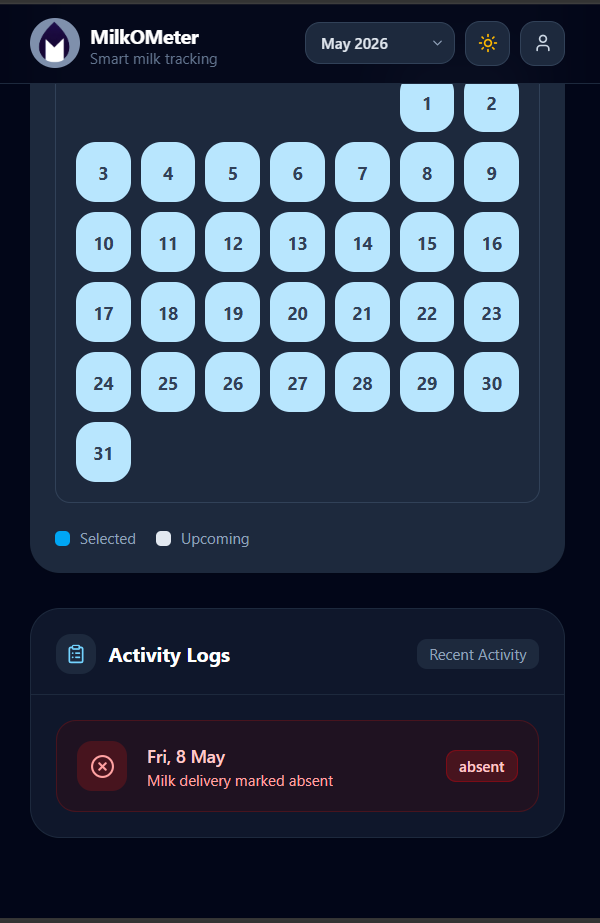
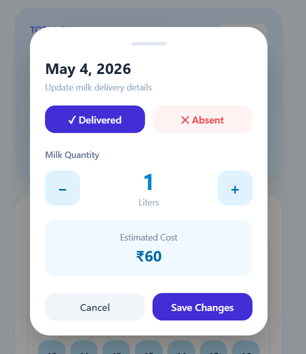

# Milkometer - Doodhwala Milk Tracker

Milkometer is a simple milk tracking application built for Indian households to help manage daily milk delivery records, monthly bills, and delivery history in an easy and organized way.

The idea behind this app is to help housewives and families avoid manually remembering:
- how much milk was delivered,
- which days milk was absent,
- monthly total expenses,
- and daily delivery tracking.

Instead of maintaining handwritten notes or WhatsApp messages, Milkometer keeps everything in one place with a clean and simple interface.

---

## Features

- Daily milk delivery tracking
- Mark milk as delivered or absent
- Monthly bill calculation
- Monthly delivery summary
- Recent activity logs
- Recurring milk setup
- Delivery start date support
- User profile management
- Dark mode support
- Responsive mobile-first UI

---
## Visit Us

URL : https://milkometer.vercel.app/

---
## Tech Stack

### Frontend
- React
- TypeScript
- Tailwind CSS
- Zustand
- React Router

### Backend
- Node.js
- Express.js
- Prisma ORM
- PostgreSQL

### Database
- PostgreSQL running with Docker

---

## App visuals

### Signup and Login

### Dashboard

### Setting

### Billing

 
 ### Activity Log

### Milk updation

---

